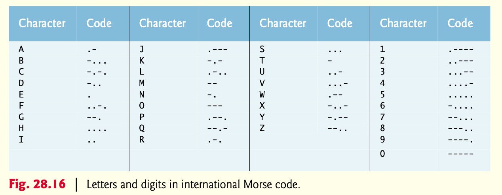
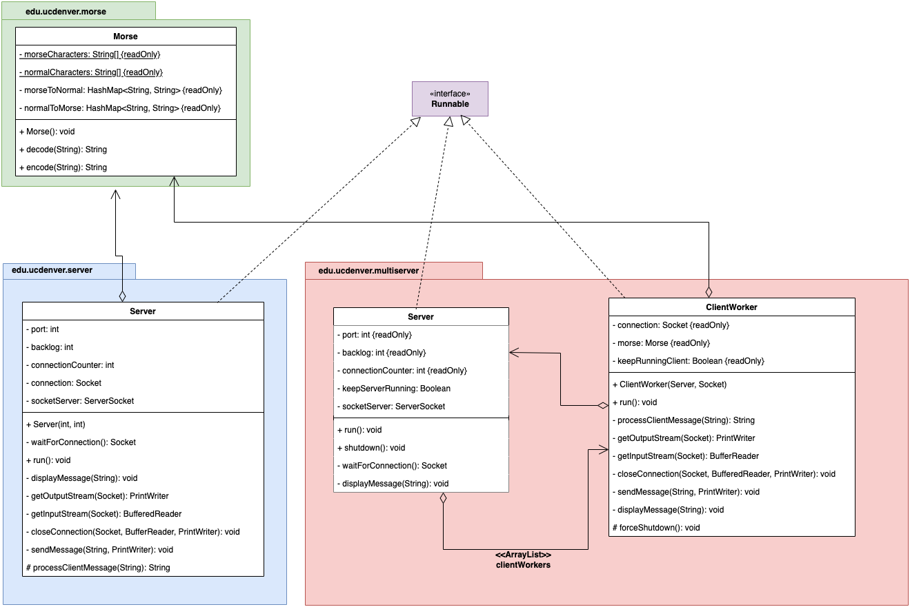

# 1. Description
This homework, the last homework on Java, will navigate through concepts of multithreading and distributed programming with sockets in Java. The homework will have 3 parts, that build on concepts. Although each part will be implemented independently, each part builds on the previous one. Therefore, after implementing part 1, you can reuse part of that code for part 2 and so on. In summary, you will be implementing an application that can code/decode strings into [Morse Code.](https://en.wikipedia.org/wiki/Morse_code) 

Morse Code is a simple character encoding that allows transmission using sound and light among others. The standard representation is dots (.) and dashes (-). When transmitted through sound the dot represents a short sound and a dash is a long sound. Words are delimited by spaces when written or by a long pause (absence of sound), while characters can be delimited by a symbol and by a short pause when transmitted by sound. 

# 2.1 Part #1 - Morse encoding

In this part, implement the class *edu.ucdenver.morse.Morse,* which provides two instance methods: *encode(String)* and *decode(String).*

- Create the class **Morse** in the package **edu.ucdenver.morse**
- Add two private hash maps (instance variables) between Strings, to map the encoding representation.
  - One will map the actual character to the sequence of dots and dashes to represent that character.
  - The other will do the reverse mapping.
  - Initialize these maps in the constructor.
- Implement the instance methods to *encode*/*decode* as follows:
  - Implement the `encode(String)` method, that given a clean string (normal text) will return the Morse Code encoded representation
    - Example:
      - Input String: `"Hello World"`
      - Output String: `"....=.=.-..=.-..=---= .--=---=.-.=.-..=-..="`
- Implement the `decode(String)` method, which given the encoded string (Morse Code) will return the clean text representation.
  - Example:
    - Input String: `"....=.=.-..=.-..=---= .--=---=.-.=.-..=-..="`
    - Output String: `"HELLO WORLD"`
- Encoding/Decoding characteristics:
  - Use the representation given in the image above.
  - After each encoded character add an equal sign (=). This will delimiter encoded characters.
  - After each word, add a space. Do not add space after the last word (at the end of the sentence).

---

# 2.2 Part #2 - Single-threaded Server/Client
In this part, you will implement a Server class that will accept only one connection, process its requests, and then the Server will end. 

- Create a `Server` class in the package `edu.ucdenver.server`
- The constructor should take the `port` and `backlog` to open the server.
- The server should implement the **`Runnable`** interface.
- Override the following public method:
  - `public void run()`
    - This will implement your server. Similar to `runServer()` from our lecture examples.
    - Upon a client connection, the server will listen for requests. Once a request is received, it will be processed (see below) and the response will be sent to the server. 
    - Keep accepting requests until the client disconnect. No termination message will be sent, the client will just disconnect. 
- **Communication Protocol:**
  - the communication will be text-based. 
  - fields will be delimited by a vertical bar: **|**
  - clients may send either two requests:
    1. **"`E|text`"** → requesting the server to **encode** the clean text *"text"* into Morse Code.
    2. **"`D|morse`"** → requesting the server to **decode** the received text *"morse"* from Morse Code representation into clean text.
  - The server may respond:
    - **"`0|text`"** → to either request. Text will be either the encoded or decoded string that answers the received request. 
    - **"`1|Not Implemented`"** → if the server receives an unrecognized request by the client. E.g., "`C|`" or "`E Hello world`"
    - **"`2|Invalid Message Format`"** → if the message format is not correct. E.g., in the message "`E`", the command is correct but the arguments received are not (in this case no text was sent).
- **Important Notes:**
  - Quotes were added just to delimit the message descriptions, and are not part of the actual message. 
  - Make sure to use the Morse Class defined in Part #1.
  - To test your server, use the text-based client class like the one implemented in class. We will be using a variation of that to test your server.
  - Make sure your **server terminates after the client disconnects**. Your code test will be aborted otherwise.

---
# 2.2 Part #3 - Multi-threaded server
Extend your server to be a multi-threaded server. In other words, your server should now accept connections from multiple clients simultaneously and treat each client independently, therefore a client can send a request and read the answer while the request of another client is being processed. 

- Create a **`Server`** class in the package **`edu.ucdenver.multiserver`** *(note the change in the package name).*

- The constructor should take the `port` and `backlog` to open the server.

- The server should implement the **`Runnable`** interface. 

- Override the following public method:

  - `public void run()`
    - This will implement your server. Similar to `runServer()` from our lecture examples.
    - Upon a client's connection, the server will start a new thread to process the client requests until it disconnects. Once that thread is started, the server main thread starts waiting for another client immediately.

- Implement the Client Worker:

  - It accepts a request from the client.
  - It processes the request and sends the proper response to the client.
  - It repeats this until the client sends the termination command. 

- **Client Requests:**

  - Implements the protocol from *Part #2*

    , extending it with the following additions:

    1. "**`T|`**" → Indicates that the client will disconnect and the client worker should stop listening for new messages. The server will reply "**`0|OK`**" to this message. 
    2. "**`TERMINATE|`**" → when a client sends this command, the server will start the shutdown process.
       - During that process, the server will execute a forceful termination of all clients, and close all sockets. 
       - After that command, all server functionality (including all client threads) should have been terminated.
       - *Hints*:
         - Implement a `forceShutdown` in your client worker. This method should stop any loop to receive messages and close the client socket. Any exception should be captured and ignored.
         - The server should keep a list of all its client workers.
         - The client worker should have a reference to the server. When this command is received the client worker will use this reference to call the server shutdown method. 
         - The server shutdown should call the forceShoutdown method to each client worker individually and forcibly shut down the server socket. Exceptions at this point should be captured but ignored. Make sure to properly set loop-controlling variables in both Server and Client Worker. 

- **Important Notes:**

  - Quotes were added just to delimit the message descriptions, and are not part of the actual message.
  - Make sure to use the Morse Class defined in Part #1
  - When two (or more) clients are connected, a client request and response can be interleaved with the others.
  - To test your server, use the text-based client class. Run several client programs in separate windows. You can even write a separate program to interleave send and receive messages from two or more client objects connected to the same server. 

---
# 3. UML Class Diagram

