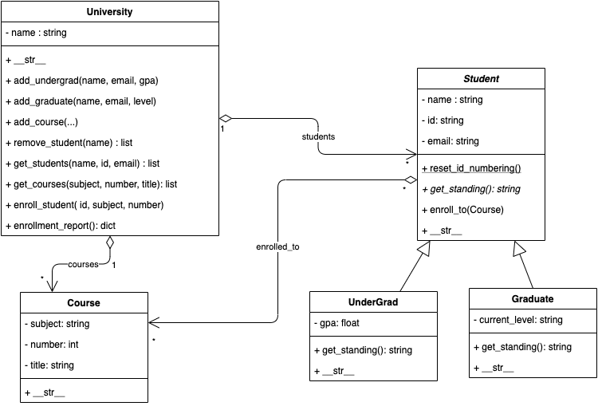

**This homework covers data structures, strings, regular expressions, and object-oriented programming in Python. Chapters 5-6, 8-10 in our textbook. You will be implementing the University classes as we discussed during our Java lectures. **

# 1. To-Do

- **Instance Attributes and Properties**

  - Protect the data to ensure encapsulation.

  - Implement properties for all instance attribute unless noted. 

    

- <u>**Student**</u>

  - Student class is an abstract class that represents general students. *Implement it as guided by exercise 10.26 on page 428 in the textbook.*

  - Properties are read-only. 

  - email data should be validated on the form of "<any text>@ucdenver.edu", and should be all lowercase.

  - Add the constructor to initialize all data. 

  - When a Student user is created, the id should be generated automatically in sequence. The first student id should be "000001" and increment by 1 once a new student object is created.

  - The *reset_id_numbering* class method should reset the numbering of the ids, restarting to 1.

  - Students can be enrolled in one or more courses, or not enrolled at all. *enroll_to* receives a course object and adds it to the enrolled_to list. 

  - <u>UnderGrad:</u>

    - Undergraduate students.

    - gpa should be between 0 and 4

    - Standing is "Undergraduate"

    - Add a constructor to initialize all data properly

  - <u>Graduate:</u>

    - Graduate (master/phd) students

    - Standing is "Master" or "PhD" depending on the current level.

    - current lever represents either "master" or "phd"

    - Add a constructor to initialize all data properly

      

- **<u>Course:</u>**

  - Represent the courses at the university.

  - all properties are read-only. 

  - implement the constructor to initialize all data properly.

    

- <u>**University:**</u>

  - Represent the university which has students and courses.

  - All properties are read-only. Student and course lists cannot be retrieved by the clients.

  - The university is responsible for creating the objects:

    - `add_undergrad(name, email, gpa)` and `add_graduate(name, email, level) `methods will create and add students to the university. The student's id will be generated automatically on the Student constructor. The data such as  GPA or Level (for graduate students) should be validated properly in each class property method. 
    - `add_course(subject, number, title)` will add a course. Will raise a ValueError exception if there is already a course with the same subject and number.
    - `get_students` and `get_courses`
      - will take optionally any of the arguments and return a list of the objects students or courses respectively, that match the search criteria.
      - String-based attributes are not an exact match but rather that the data contains that search string.
      - e.g. get_students(email="john.doe") will return a list of students whose emails have "john.doe" in it, such as "john.doe.smith@.." "william.john.doe@...", etc.
      - ***Clarification***: student and course objects should match all specified filters by the user. E.g. get_courses("CSCI", 3920) will return all courses that match both the subject and number.
      - ***Hint***: use default arguments and lists and sets to make your code simple. Consider having a matching list per filter and then computing the intersection; initialization will be critical for this to work.
    - `enroll_student(...)` will take the student's id and the course's subject and number and will enroll the student in the course. Enrollment is kept at the student as a list of courses the student is enrolled in.
    - `enrollment_report()`will return a dictionary of the form key -> value, where the key is a string representing the course (concatenation of subject and number - formatted in 4 digits with leading zeros), and the value is a list of students enrolled to that course. 
      - e.g. "CSCI3920" -> [ stu1, stu2,....]
      - **Clarification:** Only courses with enrolled students will appear in the result.

    - `remove_student(name)` removes all the students that have that name, comparing with the exact match but ignoring the case. Will return the list of students removed (may be empty).

***See [Hwk  6 Output](https://github.com/a-burlacu/CSCI-3920/blob/main/Hwk6/src/hwk6_output_sample.txt) for output formatting ***

# 2. Implementation

- Create a PyCharm project (pure python). Add an *src* directory and set it as Sources root. 
- Implement the solution in three modules:
  - ***student.py\***: that stores Student, UnderGrad, and Graduate classes
  - ***course.py\***: that stores the Course class
  - ***university.py\***: that stores the University class.
- You can optionally create a main.py to test your code or add testing code in your module files protected by `if __name__ == "__main__":`
- **You can import only modules/packages discussed in class (including \*abc\*)**
- **Use \*typing\* to describe the expected type of your objects in variables and arguments.** This was introduced in Lab #4.

# 3. UML Class Diagram

